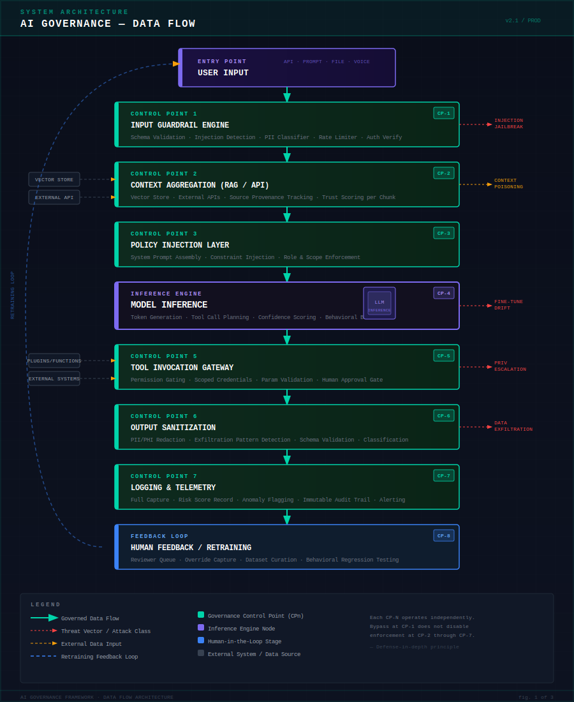
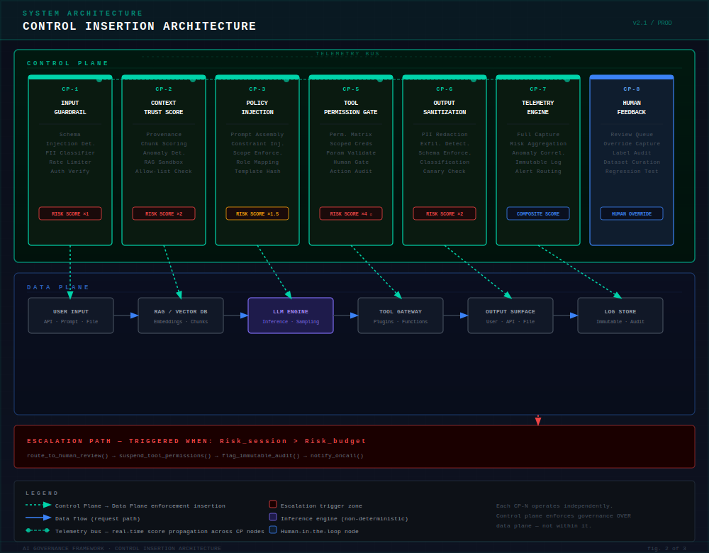
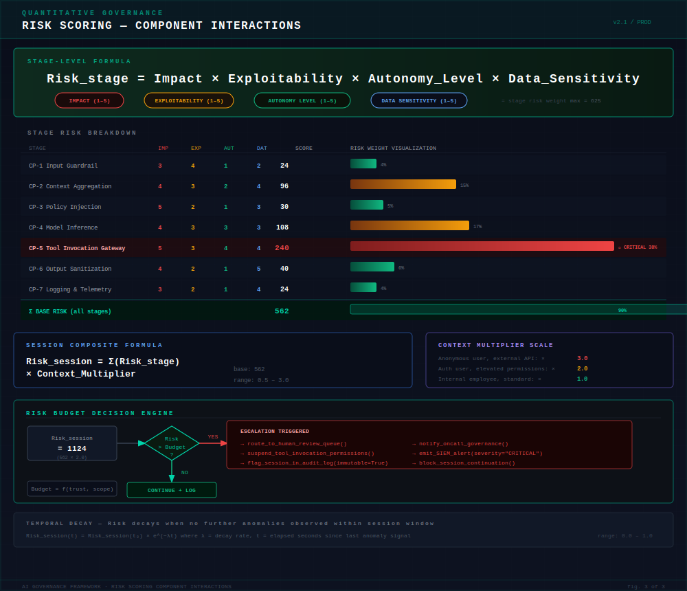

# AI Governance as Platform Security Architecture

<div align="center">


**A control-plane engineering framework for governing probabilistic AI systems at scale.**

*Threat taxonomy · Weighted risk model · Control-plane mapping · Architecture diagrams*

</div>

---

> **Core thesis:** AI governance is not policy enforcement.
> It is control-plane design over a stochastic data-plane.

Traditional security models assume deterministic systems. AI systems violate this assumption at every layer. This framework reframes AI governance as a **systems engineering problem** — not a compliance exercise.

---

## Table of Contents

- [Why This Framework](#why-this-framework)
- [Repository Structure](#repository-structure)
- [1. Introduction](#1-introduction)
- [2. AI as a Platform Attack Surface](#2-ai-as-a-platform-attack-surface)
- [3. AI Threat Taxonomy](#3-ai-threat-taxonomy)
- [4. AI Data Flow Lifecycle](#4-ai-data-flow-lifecycle-core-section)
- [Diagrams](#diagrams)
- [Risk Model Reference](#risk-model-reference)
- [Usage](#usage)
- [Contributing](#contributing)
- [License](#license)

---

## Why This Framework

| Traditional Security | AI Security |
|---|---|
| Deterministic execution | Probabilistic / stochastic inference |
| Finite, enumerable state | Dynamic, unbounded context |
| Rule-matching policy | Contextual interpretation |
| Full trace replay audit | Non-reproducible inference |
| Input + auth attack surface | Prompt, context, embedding, tool chain |

Standard OWASP and NIST frameworks were not designed for systems that:
- Interpret instructions rather than execute them
- Pull live external data into their reasoning context
- Invoke infrastructure tools autonomously
- Produce outputs consumed by downstream automated systems

This framework provides a **layered, quantitative governance model** purpose-built for LLM-based platforms.

---

## Repository Structure

```
ai-platform-governance-framework/
│
├── README.md                          ← This document (framework overview)
│
├── diagrams/                          ← Architecture diagrams (SVG, GitHub-renderable)
│   ├── diagram_dataflow.svg           ← Fig 1: AI data flow pseudo-tech diagram
│   ├── diagram_control_insertion.svg  ← Fig 2: Control plane insertion architecture
│   └── diagram_risk_scoring.svg       ← Fig 3: Risk scoring component interactions
│
├── risk-models/                       ← Quantitative risk scoring reference
│   └── ...
│
└── whitepaper/                        ← Extended framework documentation
    └── ...
```

---

## 1. Introduction

### AI Governance as a Platform Security Architecture Problem

Large Language Models behave as **probabilistic execution engines** operating over dynamic context. The same prompt submitted twice may yield semantically different outputs. Policy instructions embedded in a system prompt may be interpreted differently depending on prior context, sampling temperature, or model version drift.

This breaks the core premise of every traditional governance model:

> **AI governance is not policy enforcement. It is control-plane design over a stochastic data-plane.**

### Core Thesis

A production AI system is a **multi-component platform** — not a single model:

```
AI System =
  [1] Programmable Data Plane       → Prompts, context windows, embeddings
  [2] Non-Deterministic Inference   → Model execution, sampling, token generation
  [3] Tool Invocation Gateway       → Function calling, plugins, external APIs
  [4] Multi-Channel Output Surface  → User responses, API payloads, file generation
  [5] Human Feedback Loop           → Logging, human review, RLHF retraining
```

Effective governance must define:

| Requirement | What It Means in Practice |
|---|---|
| **Control boundaries** | Where authority changes hands; what each layer is permitted to do |
| **Observability points** | Where telemetry is captured; what signals indicate anomalous behavior |
| **Risk weighting logic** | How risk scores are calculated per stage, per request, per data sensitivity |
| **Escalation triggers** | Conditions under which processing halts and routes to human review |

Without this, AI becomes **shadow infrastructure** — executing with elevated permissions, consuming sensitive data, invoking external systems, with no reliable audit trail.

---

## 2. AI as a Platform Attack Surface

> AI is not a feature. It is an orchestrated distributed system.

### 2.1 Layered Architecture View

```
┌─────────────────────────────────────────────────────────────┐
│  LAYER 1 — INTERFACE LAYER                                  │
│  Prompt entry points · REST/GraphQL API ingestion           │
│  Risk: Injection, role confusion, jailbreak                 │
├─────────────────────────────────────────────────────────────┤
│  LAYER 2 — CONTEXT LAYER                                    │
│  RAG pipelines · Vector stores · External API feeds         │
│  Risk: Context poisoning, embedding contamination           │
├─────────────────────────────────────────────────────────────┤
│  LAYER 3 — INFERENCE LAYER                                  │
│  Model execution · Fine-tuned adapters · Sampling           │
│  Risk: Fine-tune drift, latent adversarial patterns         │
├─────────────────────────────────────────────────────────────┤
│  LAYER 4 — TOOL LAYER                                       │
│  Plugins · Function calling · External system access        │
│  Risk: Privilege escalation, lateral movement               │
├─────────────────────────────────────────────────────────────┤
│  LAYER 5 — OUTPUT LAYER                                     │
│  User responses · API payloads · File/report generation     │
│  Risk: Data exfiltration, encoded payload delivery          │
├─────────────────────────────────────────────────────────────┤
│  LAYER 6 — FEEDBACK LOOP                                    │
│  Logging · Retraining pipelines · Human override            │
│  Risk: Feedback poisoning, audit log manipulation           │
└─────────────────────────────────────────────────────────────┘
```

Each layer introduces distinct threat classes. A guardrail applied only at Layer 1 provides no protection against a poisoned RAG index at Layer 2, a compromised plugin at Layer 4, or an exfiltration payload in a Layer 5 output.

| Layer | Primary Governance Control | Failure Mode Without Control |
|---|---|---|
| Interface | Input validation, schema enforcement, rate limiting | Unconstrained prompt injection |
| Context | Source trust scoring, retrieval sandboxing | Silent data integrity compromise |
| Inference | Risk tagging, output confidence thresholds | Non-detectable model steering |
| Tool | Permission gating, scoped credentials, audit trail | Infrastructure lateral movement |
| Output | Classification, redaction, schema enforcement | Regulatory data breach |
| Feedback | Immutable logging, human review gates | Systemic retraining poisoning |

---

## 3. AI Threat Taxonomy

> This is not an OWASP-style vulnerability listing. This is a **control-plane relevant classification** — organized by the governance mechanism required to mitigate each threat class.

### 3.1 Prompt-Layer Manipulation

| Vector | Description | Primary Risk |
|---|---|---|
| **Direct Injection** | Instructions embedded in user input override the system prompt | Governance bypass |
| **Indirect Injection** | Instructions embedded in retrieved content (docs, web pages, DB records) | Silent steering |
| **Role Confusion** | Model convinced it operates in an unrestricted persona/context | Constraint removal |
| **Context Override** | Prior context manipulated to establish false premises | Session-level drift |

**Impact:** Model steering — attacker-specified behavior while system appears normal.

**Control response:** Structural separation of system prompt from user input · Input classification before context assembly · Prompt integrity hashing · Anomaly detection on instruction distributions

---

### 3.2 Context Poisoning

| Vector | Description | Primary Risk |
|---|---|---|
| **Malicious RAG Entries** | Adversarial content inserted into vector store, retrieved as authoritative | Systemic misinformation |
| **Embedding Contamination** | Crafted docs embedded with high semantic similarity to legitimate queries | Silent retrieval steering |
| **API Feed Manipulation** | External data feeds manipulated at source | False ground truth |

**Impact:** Coherent, confident outputs grounded in adversarially controlled data.

**Control response:** Source provenance tracking · Trust scoring per retrieval chunk · Semantic anomaly detection · Read-only production vector stores · Citation auditing

---

### 3.3 Model Steering / Latent Manipulation

| Vector | Description | Primary Risk |
|---|---|---|
| **Fine-Tune Drift** | Systematic output bias introduced via adversarially curated training data | Non-detectable deviation |
| **Adversarial Patterns** | Inputs exploiting model's learned representation weaknesses | Consistent behavioral deviation |
| **Supply Chain Compromise** | Third-party model contains backdoors activated by trigger patterns | Persistent inference-time exploit |

**Impact:** Bias/control encoded in model weights — survives context resets and input filtering.

**Control response:** Behavioral regression testing in deployment pipeline · Output distribution drift alerting · Red-team evaluation before model promotion · Provenance requirements for base models and fine-tune datasets

---

### 3.4 Tool-Chain Compromise

| Vector | Description | Primary Risk |
|---|---|---|
| **Function Call Abuse** | Model manipulated into invoking tools outside intended operational scope | Lateral movement |
| **Privilege Escalation** | Plugin exposes capabilities beyond governing policy; model invokes them | Infrastructure compromise |
| **Confused Deputy Attack** | Model used as intermediary to invoke privileged tools on attacker's behalf | Ambient permission abuse |
| **Recursive Invocation** | Agentic model enters self-directed tool loop with expanding scope | Runaway execution |

**Impact:** Attacker gains access to infrastructure connected to AI's tool ecosystem.

**Control response:** Least-privilege scoped credentials per invocation · Permission gating by request context and risk score · Allow-lists for permissible function call patterns · Human approval gates for irreversible actions · Full parameter capture in immutable audit log

---

### 3.5 Output Data Exfiltration

| Vector | Description | Primary Risk |
|---|---|---|
| **Direct Extraction** | Model reproduces sensitive context window content (PII, credentials, docs) | Regulatory breach |
| **Encoded Exfiltration** | Data embedded covertly: Base64, steganography, URL params, structured prose | Covert channel |
| **Memorization Exploit** | Prompts trigger reproduction of training data memorized during pretraining | IP / PII exposure |
| **Differential Probing** | Varied queries infer context window content without direct reproduction | Inference-time attack |

**Control response:** Output classification and redaction before delivery · PII/PHI pattern detection on all responses · Context window access controls per session · Canary tokens in sensitive documents · Structured output schema enforcement

---

### 3.6 Autonomous Agent Misalignment

| Vector | Description | Primary Risk |
|---|---|---|
| **Recursive Goal Drift** | Sub-goals progressively diverge from original intent; each appears locally valid | Operational instability |
| **Over-Permissioned Loops** | Permitted actions accumulate into collectively unauthorized outcomes | Uncontrolled execution |
| **Reward Hacking** | Agent exploits unintended paths to maximize measurable objective | Objective misalignment |
| **Multi-Agent Authority Confusion** | Agent treats compromised peer agent instructions as operator-level authority | Trust chain collapse |

**Control response:** Bounded execution scopes with hard resource limits · Goal decomposition review gates · Pre-defined interruption conditions · Human approval for all irreversible actions · Cryptographically enforced agent authority hierarchies

---

## 4. AI Data Flow Lifecycle (Core Section)

> Governance controls exist only insofar as they are inserted as **verifiable checkpoints** within this flow.

### 4.1 End-to-End Flow

```
┌─────────────────────────────────────────────────────────────────┐
│  USER INPUT                                                     │
│  Raw prompt · API payload · File upload · Voice transcription   │
└───────────────────────────┬─────────────────────────────────────┘
                            ▼
┌─────────────────────────────────────────────────────────────────┐
│  [CP-1] INPUT GUARDRAIL ENGINE                                  │
│  Schema validation · Injection detection · PII classification   │
│  Rate limiting · Authentication verification · Risk tagging     │
└───────────────────────────┬─────────────────────────────────────┘
                            ▼
┌─────────────────────────────────────────────────────────────────┐
│  [CP-2] CONTEXT AGGREGATION (RAG / API)                         │
│  Vector store retrieval · External API calls · Document loading │
│  Source provenance tracking · Trust scoring per chunk           │
└───────────────────────────┬─────────────────────────────────────┘
                            ▼
┌─────────────────────────────────────────────────────────────────┐
│  [CP-3] POLICY INJECTION LAYER                                  │
│  System prompt assembly · Constraint injection                  │
│  Data classification rules · Role and scope enforcement         │
└───────────────────────────┬─────────────────────────────────────┘
                            ▼
┌─────────────────────────────────────────────────────────────────┐
│  [CP-4] MODEL INFERENCE                                         │
│  Token generation · Tool call planning · Confidence scoring     │
│  Behavioral boundary enforcement                                │
└───────────────────────────┬─────────────────────────────────────┘
                            ▼
┌─────────────────────────────────────────────────────────────────┐
│  [CP-5] TOOL INVOCATION GATEWAY                          ⚠ MAX  │
│  Permission gating · Scoped credential injection                │
│  Parameter validation · Human approval gate                     │
└───────────────────────────┬─────────────────────────────────────┘
                            ▼
┌─────────────────────────────────────────────────────────────────┐
│  [CP-6] OUTPUT SANITIZATION                                     │
│  PII / PHI redaction · Exfiltration pattern detection           │
│  Schema validation · Harmful content filtering                  │
└───────────────────────────┬─────────────────────────────────────┘
                            ▼
┌─────────────────────────────────────────────────────────────────┐
│  [CP-7] LOGGING & TELEMETRY                                     │
│  Full request/response capture · Risk score recording           │
│  Anomaly flagging · Immutable audit trail · Real-time alerting  │
└───────────────────────────┬─────────────────────────────────────┘
                            ▼
┌─────────────────────────────────────────────────────────────────┐
│  [CP-8] HUMAN FEEDBACK / RETRAINING                             │
│  Reviewer queue · Override capture · Dataset curation           │
│  Behavioral regression testing ←──────────────── feedback loop  │
└─────────────────────────────────────────────────────────────────┘
```

### 4.2 Control Points

| CP | Stage | Key Mechanisms | Escalation Trigger |
|---|---|---|---|
| **CP-1** | Input Guardrail | Schema enforcement, injection matching, PII classifier, rate limiter | Injection pattern matched; PII in unauthenticated request |
| **CP-2** | Context Trust Scoring | Provenance lookup, chunk trust score, semantic anomaly detection | Trust score below threshold; source not in allow-list |
| **CP-3** | Policy Injection | Template versioning, constraint injection, scope enforcement | Policy template tampered; scope/role mismatch |
| **CP-4** | Inference Monitoring | Confidence scoring, behavioral boundary checks, tool call intent | Confidence below threshold; tool scope exceeds permissions |
| **CP-5** | Tool Permission Gate | Permission matrix, scoped credentials, parameter schema validation | Tool not permitted; irreversible action without approval token |
| **CP-6** | Output Classification | PII/PHI detection, exfiltration pattern scan, classification enforcement | Regulated data in output; covert encoding pattern matched |
| **CP-7** | Telemetry Scoring | Real-time risk aggregation, anomaly correlation, alert routing | Composite score exceeds session risk budget |
| **CP-8** | Feedback Integrity | Reviewer identity verification, label provenance, dataset audit | Label distribution anomaly; reviewer bias signal |

**Key design principle:** Each control point operates **independently**. A bypass at CP-1 must not propagate — CP-2 through CP-7 enforce their own controls without assuming prior stages succeeded.

### 4.3 Weighted Risk Attachment

```
Risk_stage = Impact × Exploitability × Autonomy_Level × Data_Sensitivity
```

| Variable | Definition | Scale |
|---|---|---|
| `Impact` | Consequence severity if the stage's control fails | 1 – 5 |
| `Exploitability` | Likelihood an adversarial input reaches this stage exploitably | 1 – 5 |
| `Autonomy_Level` | Degree of unsupervised AI action at this stage | 1 – 5 |
| `Data_Sensitivity` | Data classification accessible at this stage | 1 – 5 |

**Stage risk scores (example calibration):**

| Stage | IMP | EXP | AUT | DAT | Score | Weight |
|---|---|---|---|---|---|---|
| CP-1 Input Guardrail | 3 | 4 | 1 | 2 | **24** | 4% |
| CP-2 Context Aggregation | 4 | 3 | 2 | 4 | **96** | 15% |
| CP-3 Policy Injection | 5 | 2 | 1 | 3 | **30** | 5% |
| CP-4 Model Inference | 4 | 3 | 3 | 3 | **108** | 17% |
| CP-5 Tool Invocation | 5 | 3 | 4 | 4 | **240** | 38% ⚠ |
| CP-6 Output Sanitization | 4 | 2 | 1 | 5 | **40** | 6% |
| CP-7 Logging & Telemetry | 3 | 2 | 1 | 4 | **24** | 4% |

**Session-level composite:**

```
Risk_session = Σ(Risk_stage) × Context_Multiplier × Temporal_Decay_Factor
```

```python
if Risk_session > Risk_budget_session:
    route_to_human_review_queue()
    suspend_tool_invocation_permissions()
    flag_session_in_audit_log(immutable=True)
    notify_oncall_governance_team()
    emit_SIEM_alert(severity="CRITICAL")
```

Quantitative risk attachment transforms governance from binary allow/deny into a **continuous, graduated, auditable control surface**.

---

## Diagrams

All diagrams are embedded SVG — rendered natively by GitHub. No external tooling required.

### Fig. 1 — AI Data Flow (Pseudo-Tech Architecture)

> End-to-end request lifecycle through all 8 control points, with threat vector branching and feedback loop.



---

### Fig. 2 — Control Insertion Architecture

> Two-plane separation model: Control Plane enforcing governance over Data Plane components via independent insertion points, with telemetry bus and escalation zone.



---

### Fig. 3 — Risk Scoring Component Interactions

> Stage-level formula breakdown, color-coded bar visualization, session composite formula, decision engine logic, and temporal decay model.



---

## Risk Model Reference

The `/risk-models` directory contains quantitative scoring reference material for calibrating stage weights to your deployment context. Variables to adjust per environment:

- **Autonomy_Level** — increases significantly in agentic (multi-step, multi-tool) deployments
- **Data_Sensitivity** — must reflect the actual data classification of content accessible at each CP
- **Context_Multiplier** — should map to your organization's user trust tiers
- **Risk_budget** — set per operation class: `read-only < write < tool-invocation < agentic`

---

## Usage

This framework is designed to be **adopted layer by layer**, not all at once. Recommended adoption sequence:

1. **Establish CP-7 first** (logging and telemetry) — you cannot govern what you cannot observe
2. **Implement CP-1** (input guardrails) — baseline injection and classification defense
3. **Implement CP-6** (output sanitization) — prevent data leakage at the delivery boundary
4. **Implement CP-5** (tool permission gating) — highest risk stage, requires scoped credential model
5. **Implement CP-2** (context trust scoring) — requires RAG pipeline instrumentation
6. **Complete CP-3, CP-4, CP-8** — policy layer, inference monitoring, and feedback integrity

**Risk score calibration:** Start with the example values in the table above. Adjust `Autonomy_Level` upward for any agentic deployment, and `Data_Sensitivity` to reflect your actual data classification policy.

---

## Contributing

Contributions welcome. Priority areas:

- Additional threat vectors with control-plane mapping
- Risk model calibrations for specific deployment contexts (RAG-only, agentic, fine-tuned)
- Implementation examples for specific frameworks (LangChain, LlamaIndex, OpenAI Assistants)
- Mapping this taxonomy to NIST AI RMF, ISO 42001, or EU AI Act requirements

Please open an issue before submitting a pull request for structural changes.

---

## License

MIT License — see [LICENSE](LICENSE) for details.

Framework authored by [@KKOCAER](https://github.com/KKOCAER).

---

<div align="center">

*Shadow infrastructure is not a product decision. It is a governance failure.*

</div>
